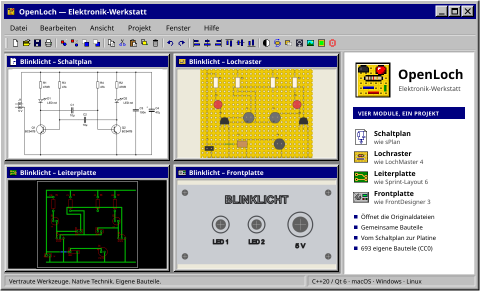
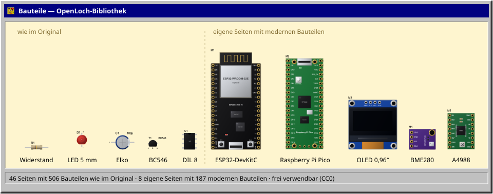

<div align="center">



<p>
<a href="#installieren"></a>
&nbsp;
<a href="docs/roadmap.md"></a>
&nbsp;
<a href="#selbst-bauen"></a>
</p>

[](https://github.com/denizkoekden/OpenLoch/actions/workflows/build.yml)

</div>

# OpenLoch

OpenLoch ist eine freie Elektronik-Werkstatt: Schaltplan, Lochrasterplatine, Leiterplatte und Frontplatte in einem Programm. Jedes der vier Module folgt eng einem bewährten Vorbild, mit denselben Werkzeugen und derselben Bedienung, und öffnet und speichert dessen Dateien. Anders als die Originale läuft OpenLoch nativ auf macOS, Windows und Linux.

Ein Projekt hält die Dokumente einer Schaltung zusammen. Aus dem Schaltplan entstehen Lochraster- und Leiterplatte: Fehlende Bauteile legt OpenLoch neben die Platine, Luftlinien zeigen, was noch zu verbinden ist, und eine Prüfung vergleicht die Platine mit den Netzen des Schaltplans. Die Frontplatte gehört mit ins Projekt: Sie zeigt die Platinen dahinter und setzt Bohrungen für LEDs, Potis, Schalter und Buchsen über ihre Bauteile.

> **Stand:** Version 0.1. Alle vier Module sind benutzbar und lesen und schreiben die Dateien ihrer Vorbilder. Jedes Modul ist Menü für Menü und Dialog für Dialog mit seinem Vorbild abgeglichen; die dabei gefundenen Lücken sind geschlossen, bewusste Abweichungen stehen auf den Seiten der Module. Offen sind vor allem Abnahmen mit den Originalen selbst. Was als Nächstes kommt, steht in der [Roadmap](docs/roadmap.md).

## Die vier Module

| Modul | Vorbild | Dateien |
| :--- | :--- | :--- |
| [Schaltplan](docs/modules/schematic.md) | sPlan 7 und 8 | sPlan-Dateien (`.spl7`, `.spl8`), verlustfrei zurückgeschrieben |
| [Lochraster](docs/lochmaster-compatibility.md) | LochMaster 4 | Projekte (`.LM4`), Platinenvorlagen (`.LMB`) und Bibliotheken (`.LIB`) |
| [Leiterplatte](docs/modules/pcb.md) | Sprint-Layout 6 | Sprint-Layout-Dateien (`.lay6` und ältere `.lay`), dazu Gerber, Excellon und Bestückungsdaten |
| [Frontplatte](docs/modules/frontpanel.md) | FrontDesigner 3 | Projekte (`.FPL`) und Bibliotheken (`.LIB`), dazu HPGL zum Bohren, Fräsen und Gravieren |

Daneben hat OpenLoch ein eigenes, offenes Format: ein Projekt (`.openloch`) mit beliebig vielen Dokumenten der vier Arten und ihren gemeinsamen Bauteilen ([Dateiformate und Projekte](docs/file-formats.md)).

## Funktionen

- **Schaltplan:** Blätter mit Formblatt, Bauteile mit Bezeichner, Wert und Kontakten aus einer mitgelieferten Symbolbibliothek, Netze mit Netznamen auch über Blätter hinweg, Texte mit Variablen und Verlinkungen, Suchen und Ersetzen, Stückliste, Druck, Export als Bild, SVG und EMF, Hilfe.
- **Lochraster:** Leitungen, Lötpunkte, Trennstellen und Bohrungen auf Loch- und Streifenraster, Bauteileinheiten, Vorlagen und Layout-Editor, Durchgangsprüfer, Potentiale, freie Bereiche und Kurzschlussprüfung, Druckvorschau wie im Original, HPGL zum Bohren und Fräsen, Stückliste als CSV oder Excel-Tabelle.
- **Leiterplatte:** Kupfer oben, unten und innen, Bestückungsdruck und Umriss, Leiterbahnen, Lötaugen, SMD-Pads und Flächen, AutoMasse, Autorouter, Design Rule Check, Spezialformen, Makros und Bauteil-Assistent, Autorouten auch entlang der Luftlinien aus dem Schaltplan, Druck mit Kacheln und Korrekturfaktoren, Gerber- und Excellon-Ausgabe, Gerber-Import, Isolationsfräsen und Bestückungsdaten.
- **Frontplatte:** Konturen, Beschriftungen, Skalen und Bemaßungen, Bohrungen, Fräsungen und Gravuren mit Strichschriften samt Zeichentabelle, Bilder, Druck und Bildexport, HPGL-Bearbeitungsdateien, die Platinen des Projekts hinter der Frontplatte.
- **Projekt:** ein Startbildschirm für alle vier Arten, ein Fenster je Dokument, jede Datei aus jedem Fenster öffnen, eine Übersicht der Bibliotheksordner aller Arten, Vergleich der Platinen mit dem Schaltplan, Luftlinien, Übernahme von Bezeichnern und Werten, fehlende Bauteile neben die Platine setzen.
- **Oberfläche:** Symbolleisten und Mauszeiger im Stil der Vorbilder, deutsch, englisch und französisch.

Eine Gegenüberstellung mit LochMaster, Punkt für Punkt, steht in [docs/lochmaster-compatibility.md](docs/lochmaster-compatibility.md); die Seiten der anderen Module beschreiben ihren Umfang ebenso genau.

## Bauteile

<p align="center"></p>

Die Lochraster-Bibliothek enthält alle 46 Seiten der LochMaster-Bibliothek mit denselben 506 Bauteilen, in derselben Reihenfolge und mit denselben Lochbildern. So bleiben Platinen zwischen beiden Programmen austauschbar. Dazu kommen acht eigene Seiten mit 187 modernen Bauteilen: ESP32- und ESP8266-Boards, Raspberry Pi Pico, Arduino, STM32 und Teensy, Sensor-, Anzeige-, Funk-, Stromversorgungs- und Treibermodule sowie aktuelle Steckverbinder und Halbleiter. Jedes Bauteil ist als Textbeschreibung in [`libraries/`](libraries) abgelegt, das Programm zeichnet daraus die Bilder. Die Bibliothek steht unter CC0.

Der Schaltplan bringt eine eigene Symbolbibliothek mit: alle 142 Seiten der sPlan-Bibliothek mit gut 2800 Symbolen, jedes neu gezeichnet und gegen Herstellerunterlagen und IEC 617 geprüft, Bausteine mit Gattern als Parent und Children wie in sPlan. Die Leiterplatte Gehäuse wie DIL, SOIC, SOT-23, TO-92 und TO-220 samt Bauteil-Assistent. Die Teile der Lochraster-Bibliothek benennen ihre Anschlüsse, gepolte Bauteile etwa mit Anode und Kathode, damit sie beim Vergleich mit dem Schaltplan von selbst passen.

Alle Bauteilbilder, Symbole, Mauszeiger und das Logo sind eigene Arbeit. Aus den Vorbildern stammen keine Grafiken, Bitmaps, Bibliotheksdateien oder sonstigen Ressourcen. Übernommen sind nur sachliche Angaben wie Seitenaufteilung, Bauteilnamen und Lochbilder. Wer LochMaster besitzt, kann dessen Bibliotheken zusätzlich einbinden (**Bibliothek → LochMaster-Bibliotheken einbinden…**). Sie werden nur gelesen.

## Beispiele

[`examples/perfboard`](examples/perfboard/README.md) enthält zwei kleine Schaltungen mit Bauanleitung, ein Zweitransistor-Blinklicht und ein Zehnkanal-Lauflicht. Beide liegen als `.openloch` und `.LM4` vor, mit Bestückungsplan sowie Stück-, Anschluss- und Drahtliste. [`examples/Blinklicht.openloch`](examples/Blinklicht.openloch) ist das Blinklicht als Projekt mit allen vier Dokumenten: Schaltplan, Lochraster- und Leiterplatte, beide mit dem Schaltplan verknüpft und gegen ihn geprüft, und eine Frontplatte mit der Lochrasterplatine dahinter und Bohrungen über ihren LEDs.

## Installieren

Bei jedem Build entstehen Pakete für alle drei Plattformen. Sie liegen in den [GitHub Actions](https://github.com/denizkoekden/OpenLoch/actions/workflows/build.yml) beim letzten erfolgreichen Lauf unter **Artifacts** (dafür ist eine GitHub-Anmeldung nötig).

| Plattform | Paket | Hinweise |
| :--- | :--- | :--- |
| macOS 14 oder neuer | `OpenLoch-macOS.dmg` | OpenLoch.app in den Programme-Ordner ziehen. Die App ist noch nicht notarisiert; beim ersten Start unter **Systemeinstellungen → Datenschutz & Sicherheit** freigeben. |
| Windows 10/11 | `OpenLoch-Windows.zip` | Entpacken und `OpenLoch.exe` starten. |
| Linux (x86-64) | `OpenLoch-Linux-x86_64.AppImage` | Ausführbar machen (`chmod +x`) und starten; Qt ist enthalten. Daneben liegt `OpenLoch-Linux.tar.gz` mit dem nackten Programm für Systeme mit eigener Qt-6-Laufzeit. |

## Erste Schritte

1. Auf dem Startbildschirm eine Dokumentart wählen, also Schaltplan, Lochraster, Leiterplatte oder Frontplatte, oder mit **Öffnen…** eine Datei laden. OpenLoch erkennt die Dateien aller vier Vorbilder und öffnet sie im passenden Fenster.
2. **Fenster → Zum Projekt hinzufügen** legt im selben Projekt ein weiteres Dokument an, etwa zum Schaltplan eine Lochrasterplatine oder eine Leiterplatte.
3. In einer Platine des Projekts legt **Fehlende Bauteile setzen…** die Bauteile des Schaltplans neben die Platine (im Lochraster im Menü **Prüfen**, in der Leiterplatte unter **Extras**). Die Luftlinien zeigen, wohin sie gehören; **Mit Schaltplan vergleichen** prüft die fertige Platine gegen die Netze.
4. **Datei → Speichern** schreibt ein Projekt als `.openloch`. Eine geöffnete Datei eines Vorbilds speichert OpenLoch in ihr Format zurück, solange sie das einzige Dokument ist; mit einem zweiten Dokument wird daraus ein Projekt.

In Schaltplan, Lochraster und Frontplatte öffnet **F1** die Hilfe des Moduls mit seinen Funktionen und Tastenkürzeln. Ungespeicherte Änderungen einer Lochrasterplatine sichert OpenLoch nach kurzer Zeit und bietet sie beim nächsten Start zur Wiederherstellung an.

## Selbst bauen

Voraussetzungen sind CMake 3.24 oder neuer, ein C++20-Compiler und Qt 6.5 oder neuer mit Core, Gui, Widgets und PrintSupport.

```sh
cmake -S . -B build -DCMAKE_BUILD_TYPE=Release -DCMAKE_PREFIX_PATH="/Pfad/zu/Qt"
cmake --build build --parallel
ctest --test-dir build --output-on-failure
```

Mit Visual Studio beim Bauen `--config Release` und beim Testen `-C Release` ergänzen. Auf macOS liegt die Anwendung danach in `build/OpenLoch.app`; `scripts/build-macos.sh` baut zusätzlich ein eigenständiges App-Paket mit DMG in `dist/`.

## Mitmachen

Fehler und Vorschläge gerne als [Issue](https://github.com/denizkoekden/OpenLoch/issues). Einige Hinweise für Änderungen am Code:

- Die Oberfläche ist deutsch; Texte laufen über `ui("…")`. Die Übersetzungen stehen je Modul in `scripts/translations/` (`T` für Englisch, `FR` in den Dateien `*_fr.py`), `python3 scripts/translations/generate.py` erzeugt daraus `src/language_en.cpp` und `src/language_fr.cpp`.
- Jedes Modul liegt unter `src/modules/<art>/` mit eigenen Tests; wie ein Modul in die Suite kommt, beschreibt [docs/suite.md](docs/suite.md).
- Neue Lochraster-Bibliotheksseiten sind JSON-Dateien in `libraries/`, das Format beschreibt [docs/open-libraries.md](docs/open-libraries.md); die Symbolseiten des Schaltplans liegen in `libraries/schematic/`.
- Vor einem Pull Request sollten Build und `ctest` durchlaufen.

## Dokumentation

| Dokument | Inhalt |
| :--- | :--- |
| [Roadmap](docs/roadmap.md) | Was als Nächstes kommt |
| [Ein Programm, vier Dokumentarten](docs/suite.md) | Startbildschirm, Fenster, Projekte und Soll-Verbindungen aus dem Schaltplan |
| [Dateiformate und Projekte](docs/file-formats.md) | Welche Dateien OpenLoch liest und schreibt, und wie Projekte Dokumente verbinden |
| [Schaltplan](docs/modules/schematic.md), [Leiterplatte](docs/modules/pcb.md), [Frontplatte](docs/modules/frontpanel.md) | Die Module mit Funktionen und Dateiformaten ihrer Vorbilder |
| [Vergleich mit LochMaster](docs/lochmaster-compatibility.md) | Das Lochraster Punkt für Punkt neben dem Original |
| [Bauteilbibliothek](docs/open-libraries.md) | Aufbau der Lochraster-Bibliothek und Format der Bauteilbeschreibungen |
| [LochMaster-Dateiformat](docs/lochmaster-format.md) | Aufbau von LM4, LMB und LIB, soweit für den Austausch nötig |
| [OpenLoch-Projektformat](docs/openloch-project-format.md) | Das eigene Format `.openloch` |
| [Logo und Grafiken](assets/README.md) | Wie Logo, Icons und die Bilder dieser Seite entstehen |

## Lizenz

OpenLoch ist freie Software unter der [GNU General Public License, Version 3 oder später](LICENSE). Die Bauteilbibliothek in `libraries/` und die Beispiele in `examples/` stehen unter [CC0 1.0](libraries/LICENSE) und sind gemeinfrei.

Was mit OpenLoch entsteht, gehört denen, die es erstellen. Schaltpläne, Platinen, Frontplatten, Stücklisten, Fertigungs- und Bohrdateien und andere Ausgaben dürfen ohne Einschränkung verwendet werden, auch kommerziell. Die GPL betrifft nur das Programm selbst.

LochMaster, sPlan, Sprint-Layout und FrontDesigner sind Produkte der ABACOM Ingenieurgesellschaft. OpenLoch ist ein unabhängiges Projekt und steht in keiner Verbindung zu ABACOM.
